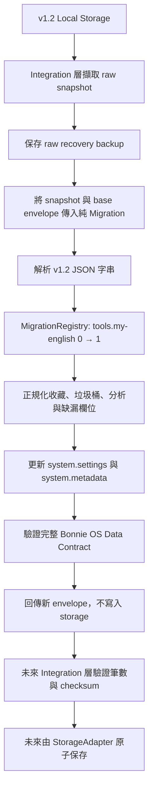
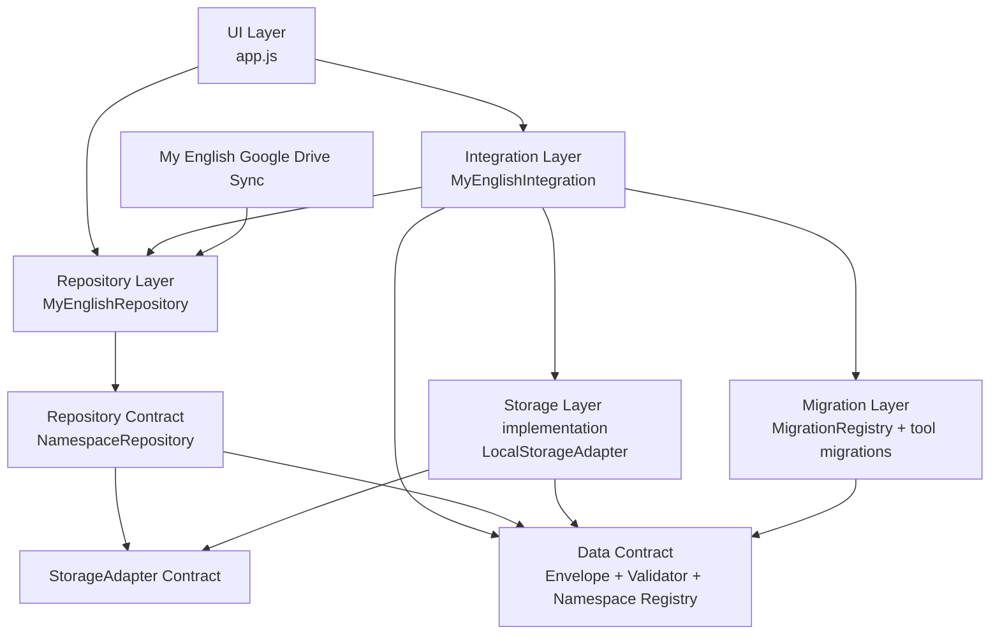

# My English

Bonnie OS（Bonnie 作業系統）的英文學習工具，使用 GitHub Pages（GitHub 靜態網站託管）發布。

## My English Data Layer

My English V2.0 保留已驗證的 Data Contract、StorageAdapter、Repository、Migration 與 Integration 邊界，但以完成 My English 為優先，不建立多工具平台或通用同步框架。

### Root contract

資料根格式使用 `bonnie-os-data`，根格式版本與 namespace schema version 分開管理。新建立的 envelope 只包含 My English 現在需要的 namespace：

- `system.settings`
- `system.metadata`
- `tools.my-english`

讀取既有資料時，`system.sync`、`system.devices`、`system.user` 或其他格式合法的未知 namespace 仍會原樣保留。

### Module boundaries

- Data Contract 只定義與驗證共用資料格式。
- Namespace Registry 只管理 namespace 定義，不含工具業務欄位。
- 共用模組不得存取 DOM、Local Storage 或任何同步服務。

### Security

Data Contract 禁止保存 OAuth access token、refresh token、Client Secret、密碼與 session cookie。OAuth access token 未來只能保存在執行期間的記憶體中，不得寫入本機資料、JSON 備份或 Sync Provider。

### Tests

Phase 1 測試不使用第三方套件：

```sh
npm test
```

測試涵蓋根格式、三個必要 namespace、資料驗證、敏感憑證拒絕，以及既有與未知 namespace 保留。

## Bonnie OS Data Layer Phase 2

Phase 2 定義非同步 `StorageAdapter` 共用介面，並提供以 storage-like dependency injection 運作的 `LocalStorageAdapter`。這些模組仍未接入 My English v1.2。

### StorageAdapter contract

- `initialize()`
- `loadEnvelope()`
- `saveEnvelope(envelope)`
- `loadRawBackup()`
- `saveRecoveryBackup(rawData)`
- `getLocalMetadata()`
- `setLocalMetadata(metadata)`

所有方法使用非同步介面，未來可由 IndexedDB 或其他非同步儲存方式實作，而不改變上層 Repository。

`LocalStorageAdapter` 僅負責讀寫、Data Contract 序列化與底層錯誤正規化。它不包含同步、Migration、Repository、工具業務邏輯或瀏覽器全域依賴；實際 storage 物件必須由未來的 composition root 注入。

## Bonnie OS Data Layer Phase 3

Phase 3 定義非同步 `Repository` contract 與通用 `NamespaceRepository`。Repository 是工具資料與 `StorageAdapter` 之間的唯一入口，但目前仍未接入 My English v1.2。

`NamespaceRepository` 提供：

- `load()`：讀取指定 namespace 的 detached data。
- `replace(data)`：只替換指定 namespace，保留其他及未知 namespace。
- `update(mutator)`：透過通用 mutator 更新指定 namespace。

同一 Repository 實例的寫入會依序執行，避免同一頁面內的非同步寫入互相覆蓋。Repository 只依賴 `StorageAdapter` contract，不辨識 Local Storage、IndexedDB 或其他實作。

`MyEnglishRepository` 目前只是綁定 `tools.my-english` 的薄層，不包含收藏欄位、Migration、同步、DOM 或 UI 邏輯。

## Bonnie OS Data Layer Migration Phase

Migration Phase 建立純函式 `MigrationRegistry`，以及 My English v1.2 snapshot 到 `tools.my-english` schemaVersion 1 的無損轉換。Migration 尚未接入 My English v1.2，也不讀寫任何 StorageAdapter。

### Migration rules

- 每一步只能註冊 `N → N+1`，禁止直接跳版。
- Migration 同步執行並回傳新資料，不得修改輸入 state 或 context。
- Registry 逐步執行所有已註冊版本，缺少任何一步就停止。
- Migration 不依賴 Repository、StorageAdapter、SyncProvider、DOM、UI 或網路。
- 時間與 base envelope 必須由呼叫端明確傳入，不讀取外部狀態。

### My English v1.2 source

Migration 接受 storage snapshot，而不是自行讀取 Local Storage。支援的來源 key 為：

- `my_english_pages_records_v1`
- `my_english_pages_current_v1`
- `my_english_pages_settings_v1`（缺少時只建立必要的語速預設；不新增聲音性別偏好）

轉換會保留收藏、垃圾桶、目前分析、未知 record 欄位與既有系統 namespace；缺少的 ID、時間、tokens 與設定使用 deterministic、安全預設值補齊。

### Migration Flow



未來 namespace schema 升級順序：

```text
讀取 namespace schemaVersion N
→ 查找 N → N+1
→ 執行純 Migration 並驗證輸出版本
→ 查找 N+1 → N+2
→ 逐版執行直到 targetVersion
→ 驗證完整 envelope
→ 回傳新資料
```

任何步驟缺失、輸出版本錯誤、輸入變更、非同步 Migration 或損壞 JSON 都會停止，不會產生可寫入結果。

## Bonnie OS Data Layer Integration Phase

Integration Layer 是唯一可讀取 v1.2 keys 並組合具體 Adapter、Migration 與 Repository 的 runtime composition root。My English UI 不再直接執行 Local Storage 的 `getItem`、`setItem` 或 `removeItem`。

Integration 初始化順序：

1. 初始化 `LocalStorageAdapter`。
2. 若 Bonnie OS envelope 已存在，直接建立 Repository，不重跑 Migration。
3. 若尚未存在，擷取三個 v1.2 key 的 raw snapshot。
4. 先以 Adapter 保存 recovery backup。
5. 建立只包含 My English 必要 namespace 的 base envelope。
6. 呼叫純函式 v1.2 Migration。
7. 驗證收藏與垃圾桶筆數。
8. 透過 Adapter 保存新 envelope。
9. 重新讀取並驗證 deterministic checksum。
10. 寫入本機 Migration completion metadata。
11. 建立並回傳 MyEnglishRepository。

所有 v1.2 keys 都會保留且不再寫入。若 Migration 失敗，新 envelope 不會建立；raw recovery backup 與舊 keys 仍可供回復。

### Bonnie OS V2.0 Architecture



依賴方向保持由上往下。Core、Storage、Migration 與 Repository 不依賴 Integration 或 UI；同步只服務 My English，不建立 Generic Sync Framework。

## My English V2.0 Minimal Scope

V2.0 停止擴張 Bonnie OS 通用平台，只加入裝置本機發音設定、三區設定頁與 My English 專用 Google Drive App Data 同步。

本機啟動：

```sh
cd /Users/bonniechang/Documents/BonnieOS/my-english/my-english
python3 -m http.server 4173 --bind 127.0.0.1
```

開啟 `http://127.0.0.1:4173/`。語速顯示 `1×（正常）` 時，Web Speech 實際 rate 為 `0.5`。聲音選單只列出裝置實際提供的 `en-US` voice，並在本機 metadata 保存 `voiceURI`。

Google Drive 同步使用 `bonnie-os-my-english-{deviceId}.json`，只包含 records、trash/tombstones 與 schema metadata；不包含 current analysis、voiceURI、語速、OAuth、Recovery Backup、legacy keys 或 UI 狀態。`src/config/public-google-config.js` 的 Client ID 留空時，同步保持停用。
